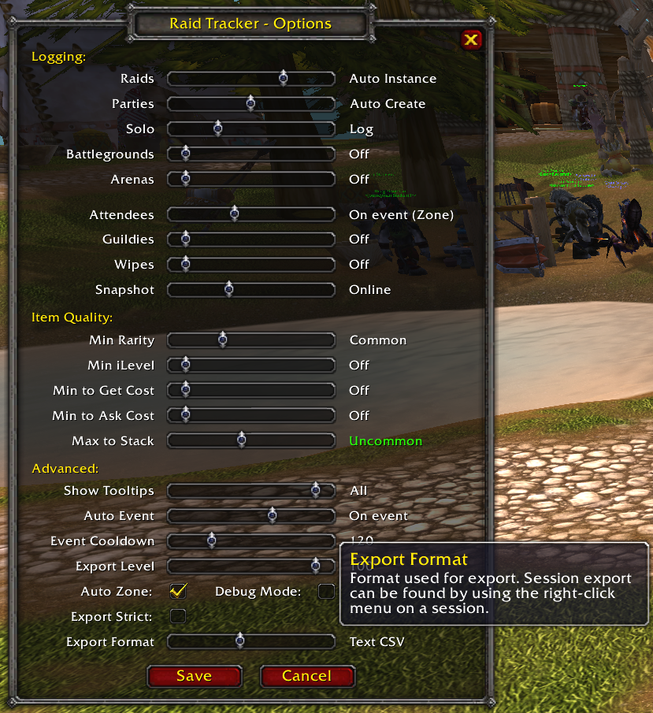
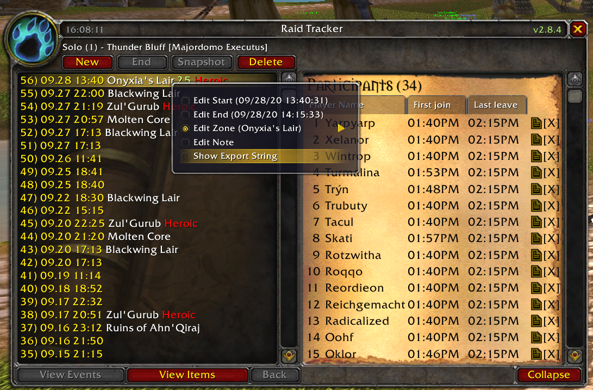
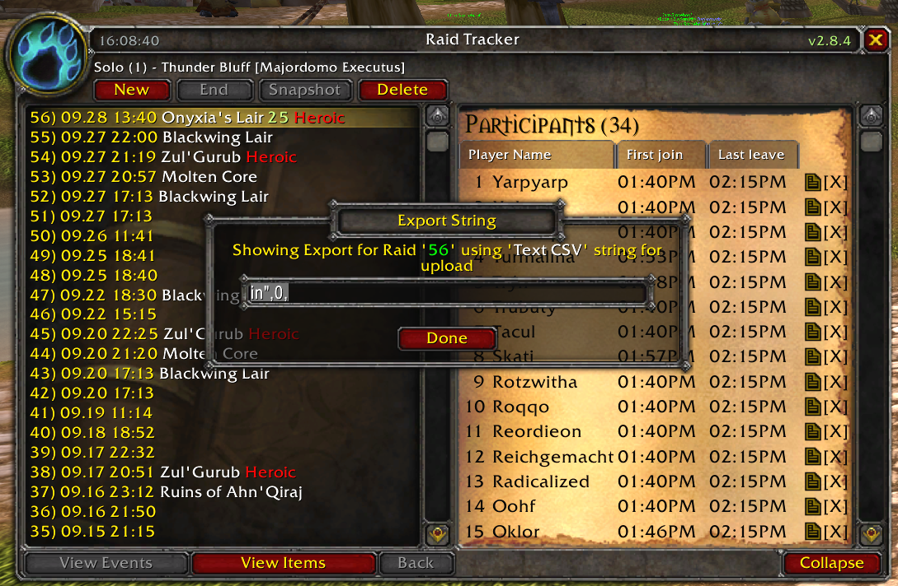

# RaidTrackerParser #

Parses WOW Classic [RaidTracker](https://wowwiki.fandom.com/wiki/Raid_Tracker) logs to a SQLite database.

# Setup
## 1. Download Addon [RaidTracker](https://wowwiki.fandom.com/wiki/Raid_Tracker)
## 2. Type "/rt options" & Set Export Format to "Text CSV"

# Export
## Choose Raid

## Export to Clipboard

